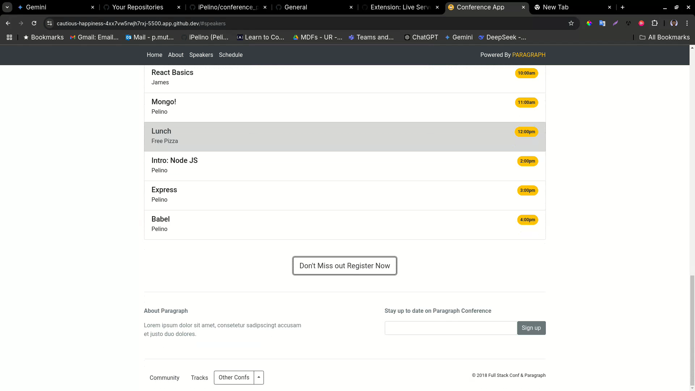

# PROJECT #

## WEBSITE DUPLICATION USING BOOTSTRAP 5 ##

## OVERVIEW ##
Created a duplicate of website seen in "project-demo.webm using html and bootstrap 5 framework.

## OBJECTIVE
- To create a website that looks as much as the one in the demo while taking a bit of liberties with the color design.
- To do so while only using HTML and Bootstrap 5 as frameworks in order to learn from them as much as I can.
- To apply as much grid and flexbox systems only using bootstrap 5

## TOOLS
- HTML
- BOOTSTRAP 5

## CHALLENGES
- Creating the speakers card grid system picture perfect was a difficult task
- Needed to do a lot of research in order to make sure the registration form appears only when the button is pressed.
- Some color schemes were not in the bootstrap so had to compensate by using styles on some parts of the code.
- Some part of the footer were not visible clearly in the demo so had to create our own parts to compliment that.

## COMPARISONS
  

  

  

  

  

  

  

  

## SETUP INSTRUCTIONS ##
1. Clone the repository
   ```bash
   git clone https://github.com/ALU-BSE/week-7-louistona.git
   ```

2. Run the html file on a web browser.

## AUTHORS

Louis Marie Toussaint Tona